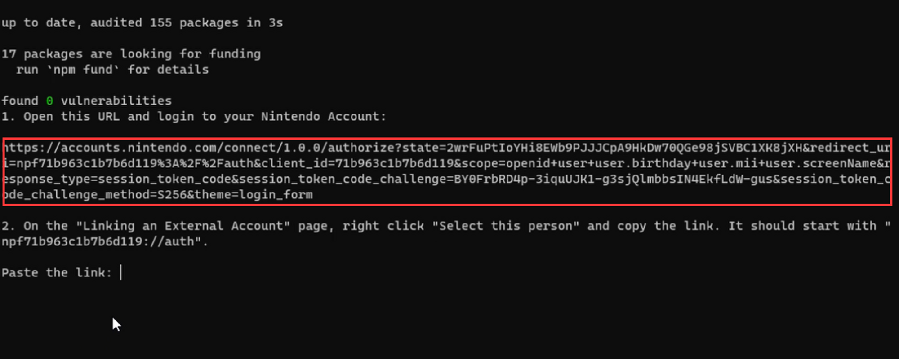
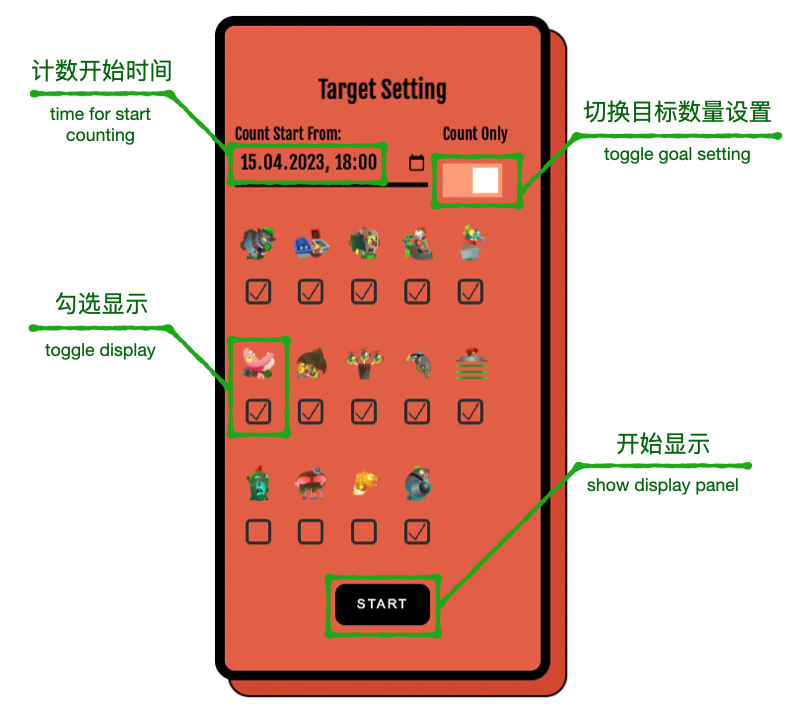

Lachs - Live Assistant for Counting Heads in Splatoon3
===
## Important notice / 重要通知❗
### 2023.04.21
- A bug in nxapi uses an outdated app version causing authorization to fail. ~~Execute tools/patch_nxapi to patch the local file until nxapi is updated.~~ The patch file will be copied when running the installation script.

    数据获取程序nxapi现版本的bug导致无法进行用户授权 ~~请使用tools文件夹里的patch_nxapi进行本地修复，并等待nxapi更新~~ 补丁文件会在运行install.bat时自动替换

## Introduction / 简介
Local web server for displaying and updating salmonid boss count in Salmon Run of Splatoon 3.

The live counting can be checked with a browser or [OBS](https://obsproject.com/) (browser source).

Use Node.js as the local backend and [nxapi](https://github.com/samuelthomas2774/nxapi) for fetching results.

斯普拉遁3打工boss击杀实时计数器

使用[nxapi](https://github.com/samuelthomas2774/nxapi)获取打工结果数据，并通过Node.js搭建本地网页服务器实现网页显示

可在[OBS](https://obsproject.com/)中添加浏览器源实现直播间统计数据显示

## Usage / 使用方法
1. Install Node.js (installer can be found on [official website](https://nodejs.org/en).
We recommend using the default install location.)
2. In Lachs folder:

    a. Windows: run ”install.**bat**”，

    b. MacOS/Linux: run ”install.**sh**”

    c. Following the instructions to authorize nxapi. If successful, the user info will show on the command window.
    This step only needs to be executed once for each user.

3. Launch web server:

    a. WINDOWS运行”Launch-Lachs-v0.7.**bat**”

    b. MacOS/Linux运行”Launch-Lachs-v0.7.**sh**”

4. After starting the monitor script, nxapi will download the recent 50 Salmon Run results.
5. Copy http://localhost:8001 to the browser or OBS browser source. 
Then set salmonid boss to monitor on the setting panel and click the start button to display counting.

❗**OBS webpage and browser webpage are independent. Start counting in the browser will not affect the display in OBS.**

When using OBS, right-click the added browser source and choose the interact button. 

The counting icons are arranged with auto line-break. Adjust the display width of the OBS browser source 
to control the number of icons on each line.

1. 安装Node.js（安装包可从[官网](https://nodejs.org/en)获取
建议使用默认安装路径）
2. 在GitHub下载，并解压后的Lachs文件夹中:

    a. WINDOWS运行”install.**bat**”，

    b. MacOS/Linux运行”install.**sh**”

    c. 安装并根据引导完成nxapi授权 授权成功后会显示用户信息 此步骤每个Switch用户只需执行一次

    
    **注意一定要复制窗口中显示的新链接到浏览器 不要刷新已经打开的网页，不要用上一次复制的链接**

    d. Napxi授权：网页登陆 my.nintendo.com 后打开命令窗口中显示的链接

3. 启动网页服务器：

    a. WINDOWS运行”Launch-Lachs-v0.7.**bat**”

    b. MacOS/Linux运行”Launch-Lachs-v0.7.**sh**”
4. 右键“选择此人”按钮并复制链接地址，粘贴到命令窗口后按回车键
5. 网页服务器启动后，nxapi将下载最近50场打工记录。
6. 复制 [http://localhost:8001](http://localhost:8001/) 到浏览器或者OBS中的浏览器源启动实时击杀统计
     

❗**OBS与浏览器界面相互独立，在浏览器中点击开始不会影响OBS中的显示**

使用OBS浏览器源时可以通过：右键-交互 进行目标设置

计数面板的boss图标采用自动换行显示 设置OBS浏览器宽度可控制每行显示数量

## FAQ / 常见问题
1. 授权时无法连接服务器：connect ETIMEDOUT
    - 授权可能需要翻墙（与登陆NSO相同）
2. 运行实时更新程序时网页出现错误
    - 可在github发布issue或者加QQ群653996475寻求帮助 必要时提供log/latest_run.log运行日志

## Updates / 版本更新

- 0.7
    - Initial commit. Boss counting function.

## License
GPL-3.0
