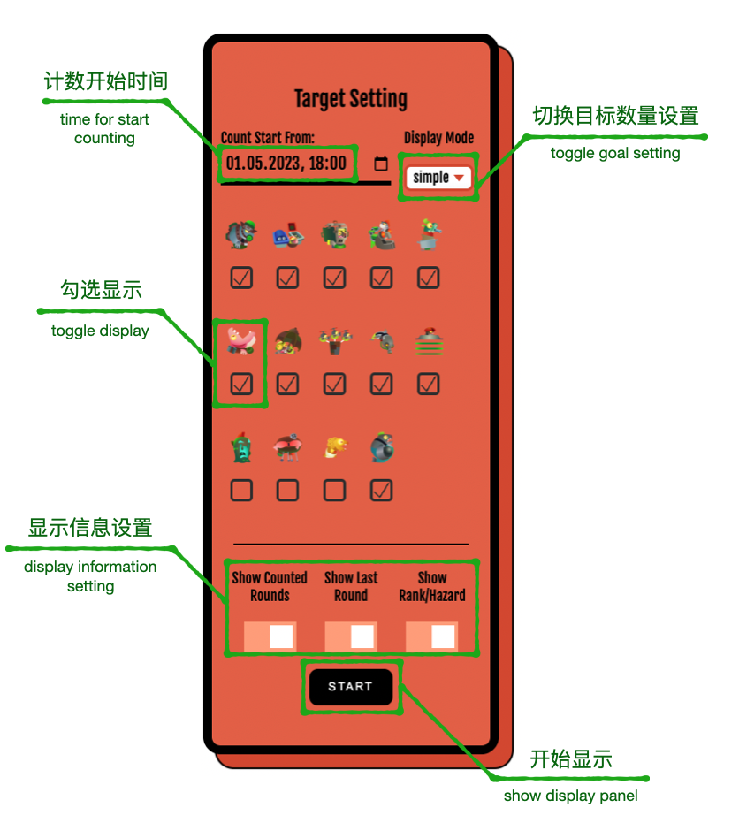

Lachs - Live Assistant for Counting Head in Splatoon3
===

Local web server for displaying and updating salmonid boss count in Salmon Run of Splatoon 3.

The live counting can be checked with a browser or [OBS](https://obsproject.com/) (browser source).

Use Node.js as the local backend and [nxapi](https://github.com/samuelthomas2774/nxapi) for fetching results.

斯普拉遁3打工boss击杀实时计数器

使用[nxapi](https://github.com/samuelthomas2774/nxapi)获取打工结果数据，并通过Node.js搭建本地网页服务器实现网页显示

可在[OBS](https://obsproject.com/)中添加浏览器源实现直播间统计数据显示

## Usage / 使用方法
First, install Node.js (installer can be found on [official website](https://nodejs.org/en))

- Windows:
    Run install.bat by double-clicking and following the instructions to authorize nxapi.
    If successful, the user info will show on the command window.
    This step only needs to be executed once for each user.
    
    To start monitoring killing counts, double-click launch-Lachs-v.07.bat.

- MacOS / Linux:
    Run install.sh, and follow the instructions to authorize nxapi.
    If successful, the user info will show on the command window.
    This step only needs to be executed once for each user.

    To start monitoring killing counts, double click launch-Lachs-v.07.sh

After starting the monitor script, nxapi will download the recent 50 Salmon Run results.
Copy http://localhost:8001 to the browser or OBS browser source. 
Then set salmonid boss to monitor on the setting panel and click the start button to display counting.

When using OBS, right-click the added browser source and choose the interact button. 

The counting icons are arranged with auto line-break. Adjust the display width of the OBS browser source 
to control the number of icons on each line.

首先安装Node.js 安装包可从[官网](https://nodejs.org/en)获取

- Windows:
    双击运行install.bat安装并根据引导完成nxapi授权 授权成功后会显示用户信息 此步骤每个Switch用户只需执行一次

    双击launch-Lachs-v.07.bat运行网页服务器

- MacOS / Linux:
    运行install.sh安装并根据引导完成nxapi授权 授权成功后会显示用户信息 此步骤每个Switch用户只需执行一次

    双击launch-Lachs-v.07.sh运行网页服务器

> nxapi授权方式：
> 1. 网页登陆 my.nintendo.com 后打开命令窗口中显示的链接
> 
> 例：https://accounts.nintendo.com/connect/1.0.0/authorize?state=99otT-Y3IeFLeEhCmnInAA8FMlSz-E2QxlsIdCsPSlYJ5pM9&redirect_uri=npf71b963c1b7b6d119%3A%2F%2Fauth&client_id=71b963c1b7b6d119&scope=openid+user+user.birthday+user.mii+user.screenName&response_type=session_token_code&session_token_code_challenge=AnSIhyxe3bqHU3XONV5-FgKuEaiwYIYvKRUhqQ6pub0&session_token_code_challenge_method=S256&theme=login_form
> 
> 2. 右键“选择此人”按钮并复制链接地址，粘贴到命令窗口后按回车键

网页服务器启动后，nxapi将下载最近50场打工记录。复制 http://localhost:8001 到浏览器或者OBS中的浏览器源启动实时击杀统计

使用OBS浏览器源时可以通过：右键-交互 进行目标设置

计数面板的boss图标采用自动换行显示 设置OBS浏览器宽度可控制每行显示数量

## License
GPL-3.0